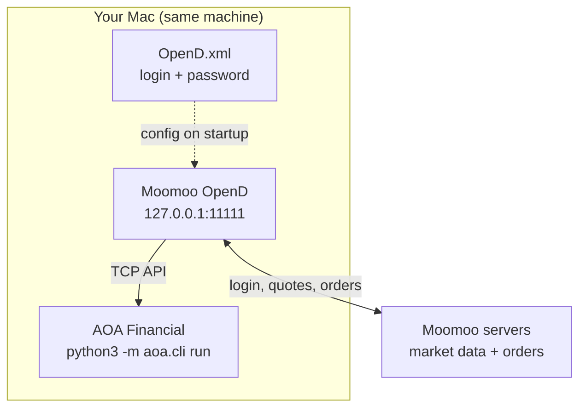
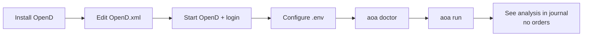

# Moomoo + AOA setup walkthrough (beginner)

Three stages — do them **in order**. Do not skip ahead.

| Stage | What you get | Orders? | Real money? |
|-------|----------------|---------|-------------|
| **A — Live data** | Real quotes & bars | No | No |
| **B — Paper trade** | Simulated orders | Yes | No |
| **C — Live trade** | Real orders | Yes | **Yes** |

---

## Architecture (all stages)



**Rule:** OpenD and AOA must run on the **same computer**. OpenD is a local gateway, not a cloud service.

---

## Stage A — Live data only (start here)

**Goal:** AOA reads real market prices. **No trades** are placed.



### A1 — Install Moomoo OpenD (you, on your Mac)

1. Download from [moomoo.com/download/OpenAPI](https://www.moomoo.com/download/OpenAPI/)
2. Or run: `bash scripts/install_moomoo_opend_macos.sh`
3. Open the **OpenD** app from Applications

### A2 — Edit OpenD.xml (you)

Find the config file next to OpenD (or via OpenD settings). Replace placeholders:

```xml
<ip>127.0.0.1</ip>
<api_port>11111</api_port>
<login_account>YOUR_MOOMOO_ID_OR_EMAIL</login_account>
<login_pwd>YOUR_PASSWORD</login_pwd>
```

Save. Restart OpenD.

### A3 — Confirm OpenD is running (you)

OpenD window should show:

- Logged in (green / connected)
- Listening on port **11111**

Quick test in Terminal:

```bash
nc -zv 127.0.0.1 11111
```

Expect: `Connection succeeded`.

### A4 — AOA project setup (automated or you)

From the AOA repo root:

```bash
pip install -e ".[dev,web]"
cp .env.example .env   # skip if .env exists
bash scripts/setup_moomoo_auth.sh
```

Edit `.env` — minimum for Stage A:

```bash
AOA_ENV=paper-dry
AOA_DRY_RUN=true
AOA_BROKER=moomoo
MOOMOO_LIVE=false
MOOMOO_OPEND_HOST=127.0.0.1
MOOMOO_OPEND_PORT=11111
ANTHROPIC_API_KEY=sk-ant-...   # required for agent reasoning
```

### A5 — Verify (you, with OpenD running)

```bash
python3 -m aoa.cli doctor
```

Success looks like:

```
✓ Moomoo OpenD target: 127.0.0.1:11111 (US, simulate)
✓ Broker reachable (moomoo-paper); equity $...
✓ Live bars API; SPY last close $...
```

### A6 — First run (you)

```bash
python3 -m aoa.cli run
```

One cycle analyzes your universe and writes to `data/paper-dry/journal/aoa.jsonl`. **No orders** in paper-dry mode.

---

## Stage B — Paper trading (after A works)

**Goal:** Real orders to Moomoo **simulate** account (fake money).

In `.env`:

```bash
AOA_ENV=paper
AOA_DRY_RUN=false
MOOMOO_LIVE=false
```

Verify: `doctor` still shows `(US, simulate)`.

Run: `python3 -m aoa.cli run` — orders go to simulate env.

---

## Stage C — Live trading (after B, intentional only)

**Goal:** Real money orders.

```bash
AOA_ENV=live
AOA_DRY_RUN=false
AOA_LIVE_ACK=I_UNDERSTAND
MOOMOO_LIVE=true
MOOMOO_UNLOCK_PASSWORD=your-trading-unlock-pin
```

`MOOMOO_UNLOCK_PASSWORD` is your Moomoo **trading unlock** PIN, not your login password.

---

## Troubleshooting

| Symptom | Fix |
|---------|-----|
| `Connect fail` | Start OpenD; check port 11111 |
| No SPY bars | Log into OpenD; confirm US market data on account |
| `ANTHROPIC_API_KEY is not set` | Add key to `.env` |
| `unlock_trade` error | Stage C only — set `MOOMOO_UNLOCK_PASSWORD` |
| Mobile app steals quotes | Keep OpenD running; `auto_hold_quote_right=1` in OpenD.xml |

---

## Helper commands

```bash
bash scripts/setup_moomoo_auth.sh      # connectivity checklist
python3 -m aoa.cli doctor --offline    # config only, no OpenD needed
python3 scripts/moomoo_setup_stage.py a   # Stage A checklist
```
